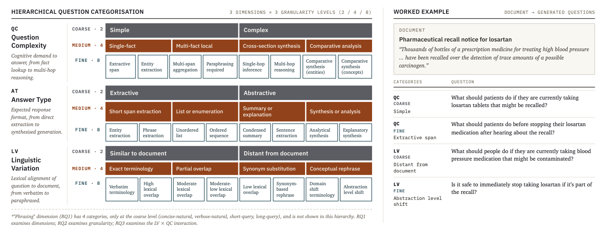

# Hybrid RAG with Diverse Dynamic Test Sets

[SIGIR 2026] Code for:  *"How Fine-Grained Should a RAG Benchmark Be? A Hierarchical Framework for Synthetic Question Generation,"* short paper accepted at SIGIR 2026.

[](https://doi.org/10.1145/3805712.3809925)
[](https://scholar.google.com/scholar?oi=bibs&cluster=YOUR_CITATION_ID)

**[Extended Results](./extended_results.md)** — supplementary tables referenced in the paper.


[](https://www.youtube.com/watch?v=S4agRPN-I2E)




**Figure**: Hierarchical structure of three question dimensions (QC, AT, LV) across three granularity levels. Each dimension subdivides from coarse (2 categories) to medium (4) to fine (8). User Expertise set to “Novice” for example QAs shown.

---

## Repository structure

```
├── rag_system/
│   └── generate/
│       ├── compute_rag_metrics.py
│       ├── generate/
            ├── config.py                      # RAG system settings
            ├── main.py                        # Answer generation entry point
            ├── retriever_utils.py
            ├── utils.py
            ├── complete_analysis.py           # Full evaluation
            ├── analyze_rq3_interactions.py
            └── complete_analysis_results.json # Full per-question results (5,872 rows)
│       ├── human_judging/
            ├── completed_human/               # Two annotators' completed annotations for synthetic QA dataset sample.
            ├── 1_aggregate_RQ1_2_3.py
            ├── ...                            # Steps 2-8 (prepare synthetic QA for human annotation, analyze)
            └── 9_plot_cr_human_correlation.py
│       └── results/
            ├── rq1_results_total.jsonl
            ├── rq2_results_total.jsonl
            └── rq3_results_total.jsonl
│ 
│
└── synthetic_qa_generate/
    ├── Driver_Synthetic_QA_RAG_Benchmark.ipynb  # DataMorgana API generation (ai71 account required)
    ├── categorization_configs.py                # All categorizations used in RQ1–RQ3
    ├── EXTRA_categorization_configs.py          # Additional fine-grained categories
    ├── QAs_RQ1/                                 # rq1_total_all_questions.jsonl
    ├── QAs_RQ2/                                 # rq2_total_all_questions.jsonl
    ├── QAs_RQ3/                                 # rq3_total_all_questions.jsonl
    └── local_datamorgana_pipeline/              # ← Run generation WITHOUT the DataMorgana API
        ├── README_local_datamorgana.md
        ├── datamorgana_local.py                 # Use this option to run pipeline via python script
        ├── Driver_Local_DataMorgana.ipynb       # Alternative, use this option to run pipeline via ipynb
        ├── configs/                             # Gives 3 example configurations (can be adjusted as needed)
        └── sample_corpus/
```

---

## Reproducing the experiments

### Step 1 — Synthetic QA generation

**Option A (exact replication):** Use the DataMorgana API via ai71 (requires an account and API key).
See `synthetic_qa_generate/Driver_Synthetic_QA_RAG_Benchmark.ipynb`.
The pre-generated datasets are already in `QAs_RQ1/`, `QAs_RQ2/`, `QAs_RQ3/` if you want to skip this step.

**Option B (no API needed):** Use the local pipeline to generate new synthetic QAs from your own corpus
with any HuggingFace-compatible model. See `synthetic_qa_generate/local_datamorgana_pipeline/README_local_datamorgana.md`.

### Step 2 — Generate RAG answers

Requires a GPU. Edit settings in `rag_system/generate/config.py`, then:

```bash
cd rag_system/generate
sbatch gen_temp.sh
```

### Step 3 — Evaluate

```bash
sbatch analyze_temp.sh
```

Full per-question results are already available in `complete_analysis_results.json`.

---

## Installation

```bash
git clone <repo_url>
pip install -r requirements.txt
python -m spacy download en_core_web_lg
```

Populate `.env` with your HuggingFace token (and ai71 token if using Option A).


## Citation
If you find this repository valuable for your research, we kindly request that you acknowledge our paper by citing the following paper. We appreciate your consideration.

If you use this work, please cite:

```bibtex
@inproceedings{fensore2026finegrainedrag,
  author = {Fensore, Chase M. and Dhole, Kaustubh and Fan, Jason and Agichtein, Eugene and Ho, Joyce C.},
  title = {How Fine-Grained Should a RAG Benchmark Be? A Hierarchical Framework for Synthetic Question Generation},
  booktitle = {Proceedings of the 49th International ACM SIGIR Conference on Research and Development in Information Retrieval (SIGIR '26)},
  year = {2026},
  location = {Melbourne, VIC, Australia},
  publisher = {ACM},
  doi = {10.1145/3805712.3809925}
}
```

